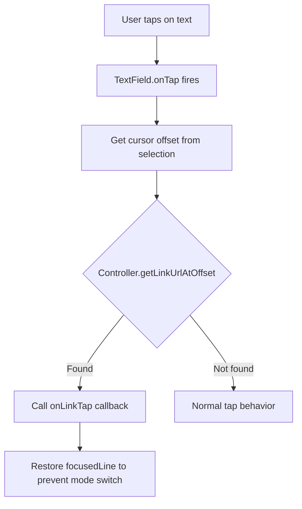

# Link Tap Handler Fix - Architecture Plan

## Problem Statement

When using `onLinkTap` callback on desktop platforms (Linux, Windows, macOS), the application crashes with the following assertion error:

```
'package:flutter/src/rendering/editable.dart': Failed assertion: line 1339 pos 14:
'readOnly && !obscureText': is not true.
```

## Root Cause Analysis

The crash occurs because Flutter's `RenderEditable` explicitly forbids `TapGestureRecognizer` attached to `TextSpan` when the `TextField` is **not** read-only on desktop platforms.

### Current Implementation (Problematic)

In [`markdown_text_editing_controller.dart`](lib/src/markdown_text_editing_controller.dart:287-291):

```dart
TapGestureRecognizer? recognizer;
if (onLinkTap != null) {
  recognizer = TapGestureRecognizer()..onTap = () => onLinkTap!(url);
  _recognizers.add(recognizer);
}
```

This `TapGestureRecognizer` is then attached to `TextSpan` via the `recognizer` parameter, which triggers the assertion on desktop platforms.

## Proposed Solution

Replace the gesture recognizer approach with **offset-based tap handling**:

1. **Controller changes**: Store link ranges instead of gesture recognizers
2. **Editor changes**: Handle taps via `TextField.onTap` and look up if the tap landed on a link

### Architecture Diagram



## Implementation Details

### 1. Changes to `MarkdownEditingController`

#### Remove
- `import 'package:flutter/gestures.dart'`
- `_recognizers` list
- `_disposeRecognizers()` method
- All `TapGestureRecognizer` creation and assignment

#### Add
- `_linkRanges`: List of link range records containing start, end, and url
- `getLinkUrlAtOffset(int offset)`: Method to look up URL at given character offset

```dart
// New data structure for storing link ranges
final List<({int start, int end, String url})> _linkRanges = [];

// New lookup method
String? getLinkUrlAtOffset(int offset) {
  for (final range in _linkRanges) {
    if (offset >= range.start && offset < range.end) {
      return range.url;
    }
  }
  return null;
}
```

#### Modify
- In `_parseMarkdown()`, when processing links, populate `_linkRanges` instead of creating gesture recognizers
- Clear `_linkRanges` at the start of each `buildTextSpan` call

### 2. Changes to `MarkdownEditor`

#### Add
- `_prevFocusedLine`: Field to store the previous focused line before tap
- `_onTap()`: Method to handle tap events

```dart
int? _prevFocusedLine;

void _onTap() {
  // Get the tapped offset from selection
  final offset = _controller.selection.baseOffset;
  
  // Check if we tapped on a link
  final url = _controller.getLinkUrlAtOffset(offset);
  if (url != null && widget.onLinkTap != null) {
    widget.onLinkTap!(url);
    // Restore focused line to prevent switching to source mode
    _controller.focusedLine = _prevFocusedLine;
  }
}
```

#### Modify
- `_onSelectionChanged()`: Save `_controller.focusedLine` to `_prevFocusedLine` before updating
- Wire `onTap: _onTap` to the `TextField`

## Code Changes Summary

### File: `lib/src/markdown_text_editing_controller.dart`

| Line | Change Type | Description |
|------|-------------|-------------|
| 1 | Remove | `import 'package:flutter/gesttures.dart'` |
| 11 | Remove | `_recognizers` field |
| 69-78 | Remove | `_disposeRecognizers()` method |
| 86 | Remove | `_disposeRecognizers()` call in `buildTextSpan` |
| New | Add | `_linkRanges` field |
| New | Add | `getLinkUrlAtOffset()` method |
| 287-291 | Remove | `TapGestureRecognizer` creation |
| 299, 316 | Remove | `recognizer` parameter from `TextSpan` |
| Link processing | Modify | Populate `_linkRanges` instead |

### File: `lib/src/markdown_editor.dart`

| Line | Change Type | Description |
|------|-------------|-------------|
| New | Add | `_prevFocusedLine` field |
| 52-54 | Modify | Save focused line before updating |
| New | Add | `_onTap()` method |
| 256 | Add | `onTap: _onTap` to TextField |

## Testing Considerations

1. Test on Linux desktop to verify no assertion errors
2. Test link tap detection accuracy
3. Test that focused line restoration works correctly
4. Test that normal text editing still works
5. Test with multiple links on same line
6. Test with links spanning special characters

## Migration Notes

This is a non-breaking change. The public API (`onLinkTap` callback) remains the same. Users of the widget do not need to modify their code.
